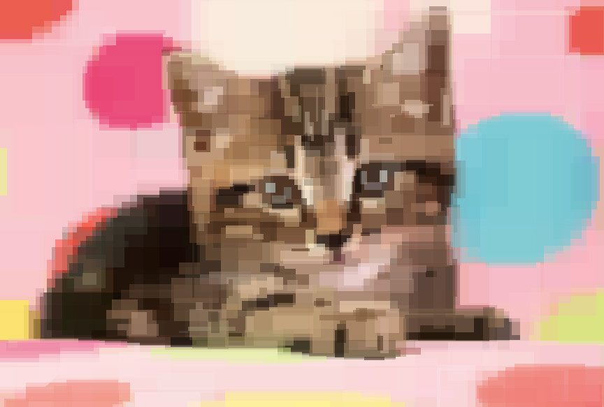

# Rectangles Fitting image
Application recreating image by drawing multiple rectangles. To achieve it we are using genetic algorithm.

**Original**


**Output**


## Preparing

### Install dependencies

**Packages**

Required to build main executable.
```
sudo apt-get install cmake libboost-python-dev libsfml-dev  python3 python3-pip jupyter-notebook
```

**Python packages**

(python part is optional, but it is recommended for analyzing algorithm)
```
pip3 install numpy matplotlib notebook
```

### Download and build
```
git clone https://gitlab.com/pktiuk/evolutionary-painter.git
cd evolutionary-painter
mkdir build
cd build
cmake ..
cmake --build .
```

## Using app

There are two ways of running this app:
- C++-based - it is used to generate output image using simple C++ executable.
```
Usage:    evolving-rectangles [OPTIONS]
          -i  input file (if not described program will show selection window)
          -p  population size (default 30)
          -g  gene pool, maximum number of rectangles on picture (default 1000)
          -c  end simulation after given amount of generations (empty or 0, no restriction)
          -t  run in terminal mode only (without drawing window)
          -h  print help
```
- Python-based - it is recommended for more research and test-focused usage. It uses C++ to python bindings.  
It can be launched imported from file `BindWrapper.py` (you can just run this file and after importing everything you will be left in the interactive mode).
You can also use Jupyter Notebook for easy tests. [Example notebook](./notebook.ipynb) - it can be launched via `jupyter notebook ./notebook.ipynb`
